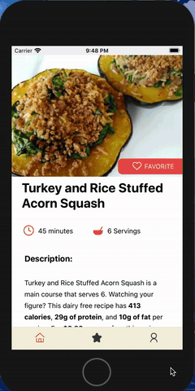
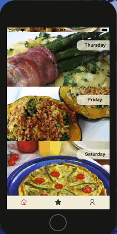

# CookStars

CookStars is a mobile App that challenges users to cook at home by offering recipes and ranking users by earning points and badges.

## Inspiration & short preview

Ordering out is on the rise! More people are ordering out because they simply do not have the time or motivation to cook. However ordering out can easily cost upwards of hundreds of dollars a month.
We built Cookstars to help people save money and avoid the frustration of planning by offering recipes weekly that they can easily follow. These recipes are diverse and tailored according to the user's dietary preference. The process of cooking is made easy and entertaining with step-by-step instruction and points awarded.

## Major features

There are three main parts in the app: Home Page, Leaderboard and User's Profile. The user can easily navigate the app through the bottom navigation bar.

Upon login the user will be directed to the Home Page with all the recipes of the week. From here the user can view recipe details and start cooking through step-by-step instructions. Upon completing the recipe of the day the user is awarded points that can unlock badges.

  

The global Leaderboard is a collection of all users and their points. The user can see their rank and their points earned among other app users'.

  

User Profile features a personalized icon, user's details, favorite recipes & recipe history, unlocked badges and number of points towards the next one. The user is also able to modify their personal information there.

  

## How we built it

Our app is built on React Native and utilizes the Expo framework to allow for quick development and iterations of our code base. For our database we used Firebase, which provides our application the ability to authenticate, retrieve and store data, and schedule API requests in the background.

The application uses API called Spoonacular to provide recipes on a weekly basis. With the information received from Spoonacular there are a lof of future possibilities for additional features like wine pairing or filtering by occasion.

## Challenges we faced

While building an app always has its many challenges we were able to overcome or circumnavigate all of them by efficient planning, communication and thoughtful guidance of our instructor - David Patlut and fellow - Nes Martinez. That being said some of the major hurdles we encountered involved learning new technologies in short time.
React Native, although very similar to React, works differently when developing on Mobile. Similarly in Firebase, learning to transition to a NoSQL database took some rewiring but we were quick to learn these new skills and apply them.

## Future plans

We already have an extensive list of unique features to work on in the future like creating more recipe options and implementing live cooking with friends. Stay tuned!

## Authors

-   **Erica Liu** - _Initial work_ - [ELiu925](https://github.com/eliu925)
-   **Asim Samuel** - _Initial work_ - [lordofdorne](https://github.com/lordofdorne)
-   **Ekaterina Serga** - _Initial work_ - [EkaterinaSerga](https://github.com/ekaterinaSerga)
-   **Cesar Done** - _Initial work_ - [CesarDone](https://github.com/cesardone)

#### Special thanks to [Fullstack Academy](https://https://www.fullstackacademy.com/) for giving us the environment to work on projects that can serve a larger community
